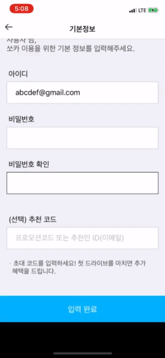
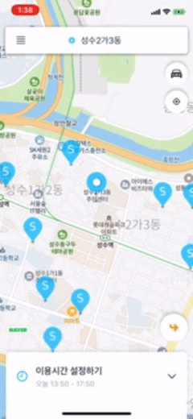

<p align="center">
  
</p>

# SOFASTCAR-iOS
카셰어링 서비스를 제공하는 [SOCAR](https://www.socar.kr/)의 iOS Application Clone 프로젝트 입니다.

## Architecture

- MVC

## Requirements
- **Language**
  - Swift 5.0
- **Framework**
  - UIKit
  - CocoaPods
  - SPM(SwiftPackageManager)
- **IDE**
  - Xcode

## Libraries
프로젝트내에서 사용한 라이브러리 목록 입니다.

| Pod | SPM |  
|:---:|:---:|
| [Swift Lynt](https://github.com/realm/SwiftLint) | [Snapkit](https://github.com/SnapKit/SnapKit#contents) |
| [Naver Map SDK](https://www.ncloud.com/product/applicationService/maps) | [Kingfisher](https://github.com/onevcat/Kingfisher) |

---

## Projcet
프로젝트 기획부터 개발까지의 흐름 입니다.

### Planning(프로젝트 기획 단계)

2020.08.20 ~ 2020.09.02까지 진행한 프로젝트 기획 입니다.

- **Development motivation**
```
  SOCAR를 구현하며 배웠던 내용을 정리하고 현재 상용화된 서비스를 
  따라 개발하며 배웠던 내용을 응용하며 개발에 자신감을 증가시키고
  개발자간의 협업을 통하여 커뮤니케이션 툴을 적극적으로 활용하여 
  커뮤니케이션 능력을 향상시키고 개발 능력을 증진시키기 위하여 
  이번 프로젝트를 시작하게 되었습니다.
```
- **MVP(Minimum Viable Product)**

<p align="center">
  
  
  
</p>

- **Tools**
  - Slack
  - Google Meet
  - [Drow.io](https://drive.google.com/file/d/1TJlzBGoK564UiSom3pa0SYx7ThbanXFv/view?usp=sharing)
<p align="center">
  
</p>


### Sprint(1차 구현 단계)

2020.09.03 ~ 2020.09.18일까지 진행한 1차 스프린트 입니다.

- **MVPDevelopment**

<p align="center" style="display: flex;justify-content: space-between;">
  
  
  
</P>

*✔️왼쪽부터 [로그인/회원가입](https://youtu.be/IFfAk-nuQko), [메인/예약](https://youtu.be/xePRUK5mTnE), [대여/반납](https://youtu.be/8T4teIXh9Uk) 화면입니다*

- **Tools**
  - 개발 일정 관리 ([Github Projects](https://github.com/SoFastCar/sofastcar-iOS/projects/3))
  <p align="center">
  
  
  </p>

  - 이슈 트래킹 ([Github Issues](https://github.com/SoFastCar/sofastcar-iOS/issues))
  <p align="center">
  
  </p>

- **2nd Sprint MVP**
  <p align="center">
  
  </p>
  


### 추가 작업 필요
---

### GitHub 관련

-  [github에 100메가 이상의 큰 파일 올리는 법 :: Learning Python](https://lpython.tistory.com/53) 

## Release
  <details> 
    <summary>v0.0.1.200918</summary><br>
    <div markdown="1">

1. 로그인 / 회원 가입
   - 휴대폰 문자 인증을 통한 사용자 식별
   - 생년월일, 아이디(이메일), 패스워드 규칙 및 정책에 따라서 정규표현식으로 필터링
   - 사용자 로그인시 서버를 통한 인증 토큰 발급
   - 인증 토큰을 통해 서버와 통신 진행
2. 메인 화면
   - 네이버 지도 연동을 통한 사용자가 선택한 위치 정보 확인
   - 사용자 위치 정보 (lat, log)와 distance 거리 변수를 통해 사용자 위치에서 일정 범위의 쏘카존 정보 불러오기
   - 쏘카존 선택시 해당 쏘카존에 주차되어 있는 쏘카 정보 로드
   - 이용시간 설정 후 쏘카 선택 -> 보험 선택 -> 예약 확인 -> 결제 진행 으로 이동
   - 차량 가격 및 보험 가격이 계산되어 최종 결제 화면 이동
3. 차량 이용 화면
   - 결제 완료 시 차량 이용과 관련된 화면으로 이동
   - 차량의 상태 확인 후 실제 운행 시작
   - 사용 종료 후 반납시 메인 화면으로 이동

    </div>
  </details>

### Refrense

- SwiftLint
  -  [iOS ) 내 프로젝트에 SwiftLint를 적용해보자](https://zeddios.tistory.com/447) 
- Naver Map SDK
  -  [iOS 에서 네이버 지도 띄우는 방법. 안녕하세요. 도미닉입니다. | by 도미닉 | Jun, 2020 | Medium](https://medium.com/@kiljh11/ios-%EC%97%90%EC%84%9C-%EB%84%A4%EC%9D%B4%EB%B2%84-%EC%A7%80%EB%8F%84-%EB%9D%84%EC%9A%B0%EB%8A%94-%EB%B0%A9%EB%B2%95-ad589928a66b) 
  -  [Console - NAVER CLOUD PLATFORM](https://console.ncloud.com/) 
- MVVM & RxSwift
  -  [[곰튀김]시즌2 모임 종합편 입니다. - YouTube](https://www.youtube.com/watch?v=iHKBNYMWd5I) 

